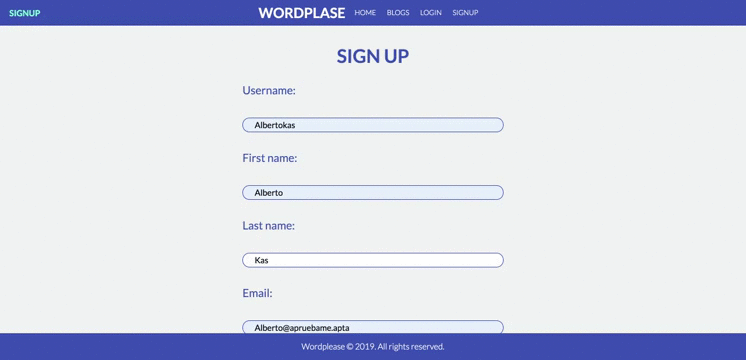
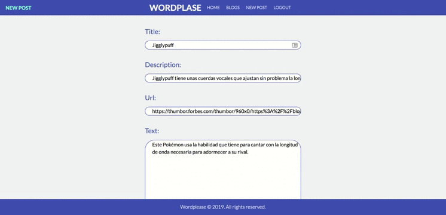

# WordPlease

## Installation
This app was developed with Django. To install and test it you have to follow the following steps:

### Clone this repo:

`git clone https://github.com/irenecav/Wordplease-django.git`

### Setup the local configurations

`virtualenv env`

`source env/bin/activate`

### Install teh requirements:
`pip install -r requirements.txt`

### Create data base
`python manage.py migrate`

### Create super user
`python manage.py createsuperuser`

### Run server
`python manage.py runserver`

## Web WordPlease

| Feature | URL | Note |
| ------- | --- | ---- |
| Sign up | `/signup/` | To register new user|
| Log in | `/login/` | Account log in |
| User blog | `/blogs/<str:username>` | User published posts |
| Post detail | `/blogs/<str:username>/<int:pk>` | Access to post detail |
| WordPlease home | `/` | Access to all users published posts |
| Create new post | `/new/` | You need to be logged |
| Admin panel | `/admin/` | Login with super admin user |
| Categories admin panel | `/admin/posts/category/` | Admin blog categories |
| Logout | `/logout/` | WordPlease logout |

### WordPlease API REST

### Users

| Method | Result | URL |
| ------ | ------ | --- |
| GET | Users list | `/api/users/` |
| POST | Sign up | `/api/users/`
| GET | User detail | `/api/users/<int:pk>` |
| PUT | User update | `/api/users/<int:pk>` |
| DELETE | User delete | `/api/users/<int:pk>` |

### Posts
| Method | Result | URL |
| ------ | ------ | --- |
| GET | Posts list | `/api/posts/` |
| GET |  Blog Posts list | `api/blogs/<str:username>` |
| POST | New post | `/api/posts/` |
| GET | Post detail | `/api/posts/<int:pk>` |
| PUT | Post update | `api/posts/<int:pk>` |
| DELETE | Post delete | `api/posts/<int:pk>` |
| GET | Blogs list | `api/blogs/` | 

## Some Screen Records

### Signup and home view

### Create new post, blog user view and post detail

